# Focal — Flowchart integral del proceso autónomo

Este diagrama es una vista derivada del entrypoint y de los módulos normativos `01` a `10`, `12` y `13`. No crea reglas nuevas. Cuando exista una diferencia, prevalece el módulo normativo y la contradicción debe corregirse mediante `SKILLS_MAINTENANCE`.

```mermaid
flowchart TD
    START([Inicio]) --> LOAD_SHA[Resolver rama predeterminada y SHA actual de krestosa/skills]
    LOAD_SHA --> LOAD_ALL[Leer íntegramente entrypoint y módulos 01 a 13 desde el mismo SHA]
    LOAD_ALL --> LOAD_OK{¿Todos existen y se leyeron hasta la última línea?}
    LOAD_OK -- No --> BLOCKED_PROMPT[BLOCKED: prompt faltante o inválido]
    LOAD_OK -- Sí --> SHA_CHANGED{¿Cambió el SHA durante la carga?}
    SHA_CHANGED -- Sí, primera vez --> RELOAD[Reiniciar una vez] --> LOAD_ALL
    SHA_CHANGED -- Sí, segunda vez --> BLOCKED_PROMPT
    SHA_CHANGED -- No --> MODE{Router de intención obligatorio}

    MODE -- Ejecutar cleanup existente --> REPOSITORY_MAINTENANCE
    MODE -- Desarrollar o reparar Focal --> FOCAL_CYCLE
    MODE -- Modificar prompts --> SKILLS_MAINTENANCE

    subgraph ADMIN[REPOSITORY_MAINTENANCE — módulo 13]
        REPOSITORY_MAINTENANCE[Clasificar scope exacto sin crear rama]
        REPOSITORY_MAINTENANCE --> MAINT_STATE[PRIMERA lectura Focal: issue #7]
        MAINT_STATE --> MAINT_IDLE{¿status idle y runId null?}
        MAINT_IDLE -- No --> MAINT_ACTIVE[ACTIVE_RUN: no adquirir ni liberar lease]
        MAINT_IDLE -- Sí --> MAINT_INGRESS[Leer issue #101 y focal-repository-maintenance:v1]
        MAINT_INGRESS --> MAINT_ROUTE{¿Ruta permanente disponible?}
        MAINT_ROUTE -- No --> MAINT_UNAVAILABLE[MAINTENANCE_EXECUTION_PATH_UNAVAILABLE]
        MAINT_ROUTE -- Sí --> MAINT_SCOPE{Scope solicitado}
        MAINT_SCOPE -- branches --> MAINT_BRANCHES[scope branches]
        MAINT_SCOPE -- garbage --> MAINT_GARBAGE[scope garbage]
        MAINT_SCOPE -- temporary_workflows --> MAINT_WORKFLOWS[scope temporary_workflows]
        MAINT_SCOPE -- all --> MAINT_ALL[scope all]
        MAINT_SCOPE -- inválido --> MAINT_SCOPE_INVALID[MAINTENANCE_SCOPE_INVALID]
        MAINT_BRANCHES --> MAINT_COMMAND
        MAINT_GARBAGE --> MAINT_COMMAND
        MAINT_WORKFLOWS --> MAINT_COMMAND
        MAINT_ALL --> MAINT_COMMAND[Escribir commandId nuevo en issue #101]
        MAINT_COMMAND --> MAINT_RUN[Ejecutar Repository Maintenance permanente]
        MAINT_RUN --> MAINT_CORRELATE{¿lastRepositoryMaintenanceCommandId correlaciona?}
        MAINT_CORRELATE -- No --> MAINT_RESULT_MISSING[MAINTENANCE_RESULT_NOT_CORRELATED]
        MAINT_CORRELATE -- Sí --> MAINT_INVARIANTS{¿Invariantes cumplidas?}
        MAINT_INVARIANTS -- Rama creada --> MAINT_CREATED_REF[MAINTENANCE_CREATED_REF]
        MAINT_INVARIANTS -- PR creada --> MAINT_CREATED_PR[MAINTENANCE_CREATED_PR]
        MAINT_INVARIANTS -- Workflow creado --> MAINT_CREATED_WORKFLOW[MAINTENANCE_CREATED_WORKFLOW]
        MAINT_INVARIANTS -- Conteo aumentó --> MAINT_COUNT[MAINTENANCE_BRANCH_COUNT_INCREASED]
        MAINT_INVARIANTS -- main cambió en branches --> MAINT_MAIN_CHANGED[MAINTENANCE_BRANCH_SCOPE_MODIFIED_DEFAULT_HEAD]
        MAINT_INVARIANTS -- Sí --> REPORT_MAINT[Reporte administrativo sin lease, roadmap, rama ni PR]
    end

    subgraph SKILLS[SKILLS_MAINTENANCE — módulo 09]
        SKILLS_MAINTENANCE --> SM1[Confirmar autorización expresa]
        SM1 --> SM2[Leer referencias, manifest y validadores]
        SM2 --> SM3[Detectar contradicciones y rutas rotas]
        SM3 --> SM4[Crear rama desde SHA remoto]
        SM4 --> SM5[Aplicar cambios cohesivos]
        SM5 --> SM6[Actualizar entrypoint, módulos, flowchart, README, validadores e integridad]
        SM6 --> SM7[Validar contratos y determinismo]
        SM7 --> SM_ARTIFACTS{¿Hay artefactos históricos?}
        SM_ARTIFACTS -- Sí --> HISTORY_SCAN
        SM_ARTIFACTS -- No --> SM8[Abrir o actualizar PR]
        SM8 --> SM9{¿CI del head exacto aprobada?}
        SM9 -- No --> SM10[Corregir fallos] --> SM6
        SM9 -- Sí --> SM_MERGE_TITLE[MERGE_TITLE_POLICY]
        SM_MERGE_TITLE --> SM11[Mergear]
        SM11 --> SM_MERGE_REFERENCE{¿Subject contiene #n?}
        SM_MERGE_REFERENCE -- No --> SM_MERGE_REFERENCE_MISSING[MERGE_PR_REFERENCE_MISSING]
        SM_MERGE_REFERENCE -- Sí --> REPORT_SKILLS[Reporte terminal]
    end

    subgraph PREFLIGHT[FOCAL_CYCLE — módulos 01, 02, 03 y 13]
        FOCAL_CYCLE --> FC1[Generar runId, commandId y límites]
        FC1 --> FC2[PRIMERA lectura Focal: issue #7]
        FC2 --> INSPECT[Escribir inspect]
        INSPECT --> POLL1[Polling real]
        POLL1 --> STATE_KIND{¿STATE_OBSERVED?}
        STATE_KIND -- Lease ajena --> NOOP_CAUSE[NOOP_CAUSE: ACTIVE_RUN]
        NOOP_CAUSE --> NOOP[NO-OP]
        STATE_KIND -- idle --> ACQUIRE[Enviar acquire]
        STATE_KIND -- lease vencida --> RECOVER[Enviar recover]
        STATE_KIND -- coordinador roto --> COORDINATOR_REPAIR
        ACQUIRE --> LEASE_ACQUIRED{¿LEASE_ACQUIRED?}
        RECOVER --> LEASE_ACQUIRED
        LEASE_ACQUIRED -- No --> LOST[Propiedad no confirmada]
        LEASE_ACQUIRED -- Sí --> REMOTE_AUDIT[Heartbeat y auditoría remota]
    end

    subgraph REPAIR[COORDINATOR_REPAIR — módulo 10]
        COORDINATOR_REPAIR --> CR_DIAG[Diagnosticar coordinador]
        CR_DIAG --> CR_FIX[Aplicar fix mínimo]
        CR_FIX --> CR_TEST[Probar inspect, acquire, heartbeat, release e idempotencia]
        CR_TEST --> CR_GREEN{¿Pruebas verdes?}
        CR_GREEN -- No --> CR_FIX
        CR_GREEN -- Sí --> HISTORY_SCAN
    end

    subgraph ROADMAP[Selección funcional]
        REMOTE_AUDIT --> ROADMAP_BOOTSTRAP_AND_IRIS_AUDIT
        ROADMAP_BOOTSTRAP_AND_IRIS_AUDIT --> WORK_SELECTION_PROOF
        WORK_SELECTION_PROOF --> SLICE_FOUND{¿Existe slice observable?}
        SLICE_FOUND -- Demasiado amplio --> DECOMPOSE_VERTICAL[Descomponer incremento vertical]
        DECOMPOSE_VERTICAL --> UNIT_RISK
        SLICE_FOUND -- Sí --> UNIT_RISK{Clasificar riesgo}
        SLICE_FOUND -- No --> ROADMAP_GRANULARITY_FAILURE
        ROADMAP_GRANULARITY_FAILURE --> ERROR_CAPTURE
        UNIT_RISK -- Bajo --> LOW_RISK_BULK
        UNIT_RISK -- Alto --> HIGH_IMPACT_INCREMENT
    end

    subgraph IMPLEMENTATION[Implementación y validación]
        LOW_RISK_BULK --> MUTATION_GUARD[Releer issue antes de cada mutación]
        HIGH_IMPACT_INCREMENT --> MUTATION_GUARD
        MUTATION_GUARD --> QUALITY_GATE[Calidad, intención y pruebas]
        QUALITY_GATE --> OPENGL_RUNTIME_HARNESS{¿Requiere OpenGL?}
        OPENGL_RUNTIME_HARNESS -- Sí --> HARNESS[focal-gl probe, compile, render y suite]
        OPENGL_RUNTIME_HARNESS -- No --> VALIDATE
        HARNESS --> VALIDATE[Validación aplicable]
        VALIDATE --> PR[Crear o actualizar PR]
        PR --> CI[Checks del head exacto]
        CI --> PARTIAL_CAUSE{¿Gates completos?}
        PARTIAL_CAUSE -- No, causa objetiva --> ROADMAP_RECONCILIATION
        PARTIAL_CAUSE -- No, corregible --> ERROR_CAPTURE
        PARTIAL_CAUSE -- Sí --> MERGE_TITLE_POLICY
        MERGE_TITLE_POLICY --> MERGE_PR_REFERENCE{¿Subject conserva #n?}
        MERGE_PR_REFERENCE -- No --> MERGE_PR_REFERENCE_MISSING
        MERGE_PR_REFERENCE_MISSING --> ERROR_CAPTURE
        MERGE_PR_REFERENCE -- Sí --> MERGE[Merge autónomo]
        MERGE --> ROADMAP_RECONCILIATION
    end

    subgraph FINALIZATION[Cierre funcional]
        ROADMAP_RECONCILIATION --> RELEASE[release: última mutación de entrega]
        RELEASE --> LEASE_RELEASED{¿LEASE_RELEASED e idle?}
        LEASE_RELEASED -- No --> RELEASE_UNKNOWN[Confirmación incompleta]
        LEASE_RELEASED -- Sí --> ASSERT_TERMINAL[Enviar assert_terminal]
        ASSERT_TERMINAL --> TERMINAL_STATE_CONFIRMED{¿TERMINAL_STATE_CONFIRMED?}
        TERMINAL_STATE_CONFIRMED -- No --> RELEASE_UNKNOWN
        TERMINAL_STATE_CONFIRMED -- Sí --> RESULT_GATE{Resultado factual}
        RESULT_GATE -- PASS --> PASS
        RESULT_GATE -- PARTIAL --> PARTIAL
        RESULT_GATE -- BLOCKED --> BLOCKED
        RESULT_GATE -- NO-OP --> NOOP_RESULT[NO-OP]
    end

    subgraph CONNECTOR_RETRY[Safeguard del conector]
        CONNECTOR_ERROR --> CONNECTOR_BACKOFF[Backoff 2, 5, 10 y 20 segundos]
        CONNECTOR_BACKOFF --> READ_AFTER_WRITE[READ_AFTER_WRITE]
        READ_AFTER_WRITE --> RETRY_SAME_OPERATION[RETRY_SAME_OPERATION]
        RETRY_SAME_OPERATION --> CONNECTOR_RETRY_EXHAUSTED
    end

    subgraph AUTONOMOUS_RECOVERY[AUTONOMOUS_RECOVERY]
        ERROR_CAPTURE --> ERROR_CLASSIFY
        ERROR_CLASSIFY -- Desconocido --> ERROR_UNKNOWN[UNCLASSIFIED_INTERNAL_FAILURE]
        ERROR_CLASSIFY -- Conocido --> ERROR_ROUTE
        ERROR_UNKNOWN --> ERROR_ROUTE
        ERROR_ROUTE --> ERROR_RESUME[Reanudar primer gate invalidado]
        ERROR_ROUTE --> ERROR_CHECKPOINT[Checkpoint por contingencia; nunca como objetivo planificado]
    end

    subgraph HISTORY_SANITATION[Historia excepcional]
        HISTORY_SCAN --> HISTORY_CLASSIFY
        HISTORY_CLASSIFY --> HISTORY_REPLAY
        HISTORY_REPLAY --> HISTORY_DATES[Preservar GIT_AUTHOR_DATE y GIT_COMMITTER_DATE]
        HISTORY_DATES --> HISTORY_FORCE_LEASE[force-with-lease]
        HISTORY_FORCE_LEASE --> HISTORY_DELETE_REFS
        HISTORY_DELETE_REFS --> HISTORY_REACHABILITY
        HISTORY_REACHABILITY --> HISTORY_CLEAR
        HISTORY_CLEAR --> SM8
        HISTORY_CLEAR --> CR_TEST
    end
```

