# Focal — Flowchart integral del proceso autónomo

Este diagrama es una vista derivada del entrypoint y de los módulos `01` a `10`. No crea reglas nuevas. Cuando exista una diferencia, la regla normativa es el módulo indicado en el nodo y la contradicción debe corregirse mediante `SKILLS_MAINTENANCE`.

```mermaid
flowchart TD
    START([Inicio]) --> LOAD_SHA[Resolver rama predeterminada y SHA actual de krestosa/skills]
    LOAD_SHA --> LOAD_ALL[Leer íntegramente entrypoint y módulos 01 a 11 desde el mismo SHA]
    LOAD_ALL --> LOAD_OK{¿Todos existen y se leyeron hasta la última línea?}
    LOAD_OK -- No --> BLOCKED_PROMPT[BLOCKED: prompt faltante, vacío, ilegible o inválido]
    LOAD_OK -- Sí --> SHA_CHANGED{¿Cambió el SHA durante la carga?}
    SHA_CHANGED -- No --> MODE{Determinar modo autorizado}
    SHA_CHANGED -- Sí, primera vez --> RELOAD[Reiniciar una sola vez desde el nuevo SHA] --> LOAD_ALL
    SHA_CHANGED -- Sí, segunda vez --> BLOCKED_PROMPT

    MODE -- SKILLS_MAINTENANCE --> SM1
    MODE -- FOCAL_CYCLE --> FC1

    subgraph SKILLS_MAINTENANCE[SKILLS_MAINTENANCE — módulo 09]
        SM1[Confirmar autorización expresa para modificar krestosa/skills]
        SM1 --> SM2[Leer entrypoint, módulos, referencias, manifest, validadores y archivos afectados]
        SM2 --> SM3[Reconstruir precedencias y detectar contradicciones, rutas rotas o sistemas paralelos]
        SM3 --> SM4[Crear rama desde el SHA remoto observado]
        SM4 --> SM5[Aplicar cambios cohesivos sin ampliar autorización]
        SM5 --> SM6[Actualizar entrypoint, módulos, flowchart, README, manifest y validadores]
        SM6 --> SM7[Regenerar shared/manifests/integrity.json]
        SM7 --> SM8[Validar Markdown, referencias, inventario, contratos, tests y determinismo]
        SM8 --> SM9[Abrir o actualizar PR]
        SM9 --> SM10{¿CI del head exacto está aprobada?}
        SM10 -- No --> SM11[Corregir fallos causados] --> SM7
        SM10 -- Sí --> SM12[Mergear]
        SM12 --> SM13[Verificar SHA final y ausencia de contradicciones activas]
        SM13 --> REPORT_SKILLS[Emitir reporte terminal único; roadmap e Iris no aplican]
    end

    subgraph PREFLIGHT[Preflight FOCAL_CYCLE — módulos 01 y 02]
        FC1[Generar runId UUID v4, startedAt UTC y reloj monotónico]
        FC1 --> FC2[Clasificar topología y fijar soft stop 50m, cleanup 55m, hard stop 58m30s]
        FC2 --> FC3[PRIMERA llamada remota a krestosa/Focal: leer issue #7 completo]
        FC3 --> FC4{¿Título, focal-command:v3, focal-state:v3 y schemaVersion 3 son válidos?}
        FC4 -- Sí --> FC5[Resolver únicamente rama predeterminada y SHA de main para baseMainSha]
        FC4 -- No --> CR_GATE
    end

    subgraph COORDINATION[Gate de coordinación — módulos 01 y 03]
        FC5 --> INSPECT[Primera mutación: reemplazar solo el JSON de focal-command:v3 con inspect]
        INSPECT --> POLL_INSPECT[Registrar hora y releer cada 5 a 10 segundos]
        POLL_INSPECT --> INSPECT_OK{¿lastCommandId correlaciona y razón STATE_OBSERVED?}
        INSPECT_OK -- No --> POLL_TIME{¿Pasaron 45 segundos reales o existe run terminal fallido?}
        POLL_TIME -- No --> POLL_INSPECT
        POLL_TIME -- Sí --> CR_GATE
        INSPECT_OK -- Sí --> STATE_KIND{Evaluar focal-state:v3}
        STATE_KIND --> FOREIGN{¿Existe lease ajena futura?}
        FOREIGN -- Sí --> NOOP[NO-OP: no adquirir, no analizar trabajo funcional, no mutar]
        FOREIGN -- No --> IDLE{¿status idle y runId null?}
        IDLE -- Sí --> ACQUIRE[Enviar acquire con runId propio, límites y lease inicial de 30 minutos]
        IDLE -- No --> EXPIRED{¿Lease vencida y recuperable sin actividad positiva?}
        EXPIRED -- No --> BLOCKED_LOCK[BLOCKED o NO-OP: no existe propiedad segura]
        EXPIRED -- Sí --> RECOVER_AUDIT[Inspección limitada de rama, PR, checkpoint y workflows mutadores]
        RECOVER_AUDIT --> RECOVER[Enviar recover con runId nuevo y mode recovery]
        ACQUIRE --> POLL_LOCK[Polling temporal real y correlación por commandId]
        RECOVER --> POLL_LOCK
        POLL_LOCK --> OWNED{¿working + runId propio + aceptación + razón esperada + lease futura?}
        OWNED -- No --> BLOCKED_LOCK
        OWNED -- Sí --> HB_AUDIT[Enviar heartbeat de fase REMOTE_STATE_AUDIT]
        HB_AUDIT --> HB_AUDIT_OK{¿HEARTBEAT_ACCEPTED?}
        HB_AUDIT_OK -- No --> LOST[Detener: propiedad no confirmada]
        HB_AUDIT_OK -- Sí --> REMOTE_AUDIT
    end

    subgraph COORDINATOR_REPAIR[COORDINATOR_REPAIR bootstrap — módulo 10]
        CR_GATE{¿Issue idle, sin propietario activo y reparación expresamente autorizada?}
        CR_GATE -- No --> BLOCKED_COORD[BLOCKED: no iniciar desarrollo funcional]
        CR_GATE -- Sí --> CR_CLASSIFY[Clasificar fallo: issue/workflow ausente o inválido, timeout real, run fallido, permisos, sender, YAML, imports, PYTHONPATH, API o recursión]
        CR_CLASSIFY --> CR_READ[Leer únicamente coordinador, dependencias, tests, runs, jobs y logs]
        CR_READ --> CR_FIX[Aplicar fix exclusivamente mediante conector GitHub o GitHub Actions]
        CR_FIX --> CR_TEMP[Usar solo ramas, workflows, refs y commits temporales de transporte]
        CR_TEMP --> CR_TEST[Probar inspect, acquire, lease ajena, heartbeat, release, idempotencia e invocación real]
        CR_TEST --> CR_GREEN{¿Checks del árbol exacto están verdes?}
        CR_GREEN -- No --> CR_REPAIR[Corregir únicamente infraestructura de coordinación] --> CR_TEST
        CR_GREEN -- Sí --> CR_PUBLISH[Publicar el árbol reparado sin alterar lógica funcional]
        CR_PUBLISH --> CR_CLEAN[Eliminar refs temporales y reescribir mediante GitHub Actions para que main no conserve commits de reparación alcanzables]
        CR_CLEAN --> CR_VERIFY[Verificar árbol final exacto, parent y metadata preservados, workflow temporal ausente y cero commits de reparación alcanzables]
        CR_VERIFY --> CR_SMOKE[Enviar inspect nuevo y aplicar polling real]
        CR_SMOKE --> CR_SMOKE_OK{¿STATE_OBSERVED?}
        CR_SMOKE_OK -- No --> BLOCKED_COORD
        CR_SMOKE_OK -- Sí --> CR_DIAG[Opcional: acquire diagnóstico corto, heartbeat y release]
        CR_DIAG --> CR_IDLE{¿idle + runId null + LEASE_RELEASED?}
        CR_IDLE -- No --> BLOCKED_COORD
        CR_IDLE -- Sí --> CR_RESTART[Descartar run diagnóstico, crear runId funcional nuevo y reiniciar desde issue #7]
        CR_RESTART --> FC3
    end

    subgraph REMOTE_STATE[Auditoría remota autorizada — módulos 01 y 03]
        REMOTE_AUDIT[Releer SHA de main]
        REMOTE_AUDIT --> RA2[Inspeccionar ramas, PRs, commits, checks, workflows, releases, roadmap y matriz]
        RA2 --> RA3{¿Existe trabajo remoto incompleto compatible?}
        RA3 -- Sí --> RA4[Retomar rama, PR o checkpoint; preservar evidencia y marcar REVALIDAR cuando corresponda]
        RA3 -- No --> ROADMAP_START
        RA4 --> ROADMAP_START
    end

    subgraph ROADMAP_IRIS[ROADMAP_BOOTSTRAP_AND_IRIS_AUDIT — módulos 04 y 05]
        ROADMAP_START[Leer o crear docs/ROADMAP.md]
        ROADMAP_START --> RI2[Leer o crear docs/IRIS-CAPABILITY-MATRIX.md]
        RI2 --> RI3[Auditar estados contra main, ramas, PRs, checks y evidencia]
        RI3 --> RI4[Verificar capacidades contra documentación primaria de Iris]
        RI4 --> RI5[Mantener enlaces bidireccionales roadmap ↔ matriz y campo Iris docs]
        RI5 --> RI6{¿Existe unidad coherente, dependencias resueltas y tiempo suficiente?}
        RI6 -- No --> RECONCILE
        RI6 -- Solo documentación --> DOC_ONLY[Publicar corrección documental sin forzar feature] --> RECONCILE
        RI6 -- Sí --> UNIT_DEFINE
    end

    subgraph IMPLEMENTATION[Unidad funcional — módulos 01, 02 y 06]
        UNIT_DEFINE[Definir objetivo, alcance, archivos, aceptación, pruebas, evidencia y condición de parada]
        UNIT_DEFINE --> UNIT_BRANCH[Retomar o crear una rama no forzada desde el SHA verificado]
        UNIT_BRANCH --> MUTATION_GUARD
        MUTATION_GUARD[Antes de cada mutación: releer issue #7 y comprobar runId propio + lease futura + margen ≥5m]
        MUTATION_GUARD --> MARGIN{¿Propiedad y margen válidos?}
        MARGIN -- No, margen bajo --> RENEW[Enviar heartbeat con fase, rama, head, PR y checkpoint] --> RENEW_OK{¿HEARTBEAT_ACCEPTED?}
        RENEW_OK -- No --> LOST
        RENEW_OK -- Sí --> MARK_PROGRESS
        MARGIN -- No, propiedad perdida --> LOST
        MARGIN -- Sí --> MARK_PROGRESS[Marcar ítem 🟡 EN PROGRESO]
        MARK_PROGRESS --> IMPLEMENT[Implementar solución mínima completa sin reducir criterios]
        IMPLEMENT --> OPENGL{¿La unidad requiere shaders o validación gráfica?}
        OPENGL -- Sí --> HARNESS[Ejecutar OPENGL_RUNTIME_HARNESS: focal-gl probe, compile, render y suite]
        OPENGL -- No --> CHECKPOINT
        HARNESS --> CHECKPOINT[Crear checkpoint remoto antes de validación extensa, CI, merge o soft stop]
        CHECKPOINT --> VALIDATE
    end

    subgraph VALIDATION[Validación, PR y merge — módulo 07]
        VALIDATE[Ejecutar tests, lint, compilación, contratos, OpenGL, readback y pruebas aplicables]
        VALIDATE --> DIFF[Revisar diff completo, referencias, seguridad, compatibilidad y rendimiento]
        DIFF --> PR[Crear o actualizar PR con alcance, riesgos, pruebas y estado del roadmap]
        PR --> CI[Inspeccionar checks del head exacto]
        CI --> CI_RESULT{¿Checks requeridos aprobados?}
        CI_RESULT -- Fallo causado --> FIX[Corregir y volver a validar] --> MUTATION_GUARD
        CI_RESULT -- Pendiente o falta evidencia --> PARTIAL_CP[Preservar rama, PR y checkpoint; no marcar completado] --> RECONCILE
        CI_RESULT -- Sí --> MERGE_GUARD[Releer issue, renovar si corresponde y verificar head exacto]
        MERGE_GUARD --> MERGE_OK{¿Propiedad, head y gates siguen válidos?}
        MERGE_OK -- No --> LOST
        MERGE_OK -- Sí --> MERGE[Merge autónomo compatible con política del repo]
        MERGE --> POST_MERGE[Verificar main y CI post-merge]
        POST_MERGE --> RECONCILE
    end

    subgraph RECONCILIATION[ROADMAP_RECONCILIATION — módulos 04 y 05]
        RECONCILE[Releer estado remoto final disponible]
        RECONCILE --> RC2[Actualizar roadmap según evidencia en main, no intención ni workspace]
        RC2 --> RC3[Actualizar matriz Iris y enlaces]
        RC3 --> RC4[Asignar ⚪ PENDIENTE, 🟡 EN PROGRESO, 🟢 COMPLETADO, 🟣 REVALIDAR o 🔴 BLOQUEADO]
        RC4 --> RC5[Publicar toda mutación documental y checkpoint antes del release]
        RC5 --> FINAL_TIME{¿Se alcanzó soft stop, cleanup o hard stop?}
        FINAL_TIME -- Sí --> FINALIZE
        FINAL_TIME -- No --> FINALIZE
    end

    subgraph FINALIZATION[Cierre obligatorio — módulos 01, 03 y 08]
        FINALIZE[Detener procesos propios y confirmar que todo trabajo preservable está remoto]
        FINALIZE --> FINAL_GUARD[Releer issue y confirmar propiedad por última vez]
        FINAL_GUARD --> CAN_RELEASE{¿Sigue siendo propietario?}
        CAN_RELEASE -- No --> LOST_NO_RELEASE[No liberar lease ajena; reportar PARTIAL o BLOCKED]
        CAN_RELEASE -- Sí --> RELEASE[ÚLTIMA mutación remota: enviar release]
        RELEASE --> RELEASE_POLL[Después de release: solo lecturas del issue con demoras reales]
        RELEASE_POLL --> RELEASE_OK{¿idle + runId null + lastRunId propio + LEASE_RELEASED?}
        RELEASE_OK -- No --> RELEASE_UNKNOWN[Reportar confirmación incompleta sin nuevas mutaciones]
        RELEASE_OK -- Sí --> REPORT[Emitir una sola plantilla terminal con SHAs, PR, CI, roadmap, Iris, checkpoint y comandos]
    end

    LOST --> PARTIAL_LOST[PARTIAL o BLOCKED según exista checkpoint remoto útil] --> RPT0
    LOST_NO_RELEASE --> RPT0
    RELEASE_UNKNOWN --> RPT0
    REPORT --> END([Fin])
    REPORT_SKILLS --> END
    NOOP --> RPT0[Emitir reporte terminal único]
    BLOCKED_PROMPT --> RPT0
    BLOCKED_LOCK --> RPT0
    BLOCKED_COORD --> RPT0
    PARTIAL_CP --> RECONCILE
    RPT0 --> END
```

## Lectura del diagrama

- Ningún nodo de desarrollo funcional es alcanzable sin `LEASE_ACQUIRED` o `LEASE_RECOVERED` confirmado.
- `COORDINATOR_REPAIR` no es una lease ni una tercera modalidad funcional. Es una excepción bootstrap limitada al coordinador.
- Los commits funcionales ordinarios del desarrollo permanecen sujetos a rama, PR, CI y merge. Solo los artefactos y commits temporales usados para reparar el coordinador antes de una lease deben desaparecer de la historia alcanzable de `main`.
- `release` es siempre la última mutación remota de un ciclo funcional. La limpieza administrativa de ramas se ejecuta por separado cuando el issue ya está `idle`.
